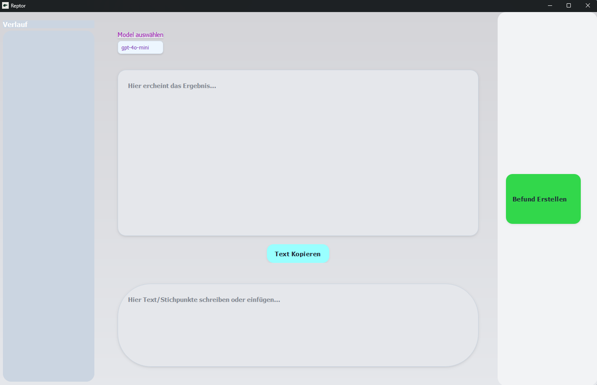
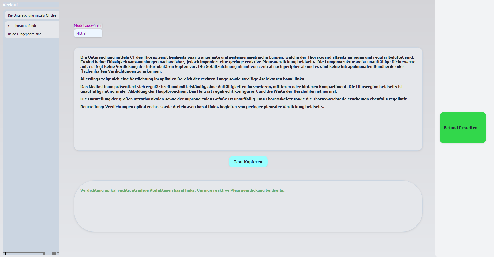
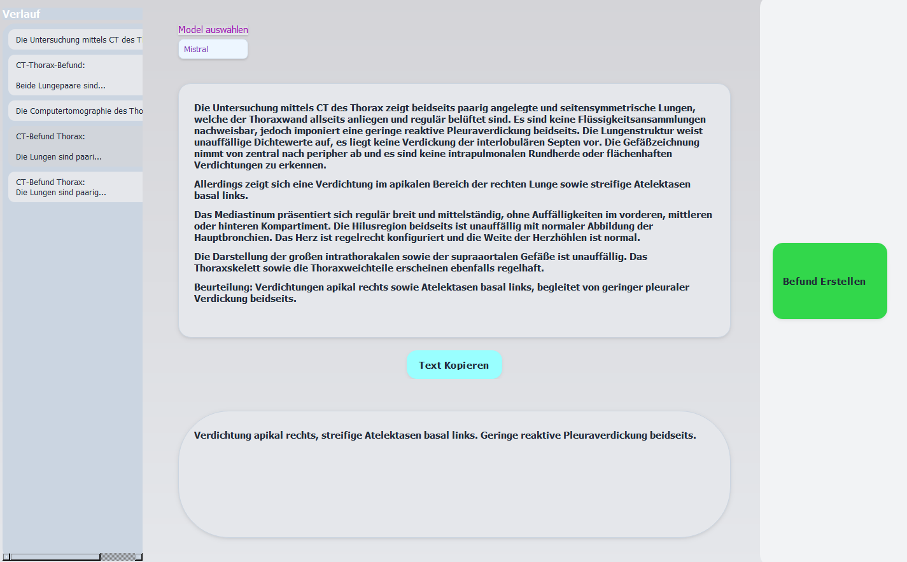

# 🦖 Reptor: AI-Powered Radiology Report Assistant

**Reptor** is a desktop application designed to assist radiologists by transforming free-text clinical notes into structured radiology reports using large language models (LLMs).  
Currently optimized for **chest CT** report generation.

---

## 📸 Interface

-   

---

## ✨ Key Features

- 🧠 **AI-Generated Reports**  
  Automatically generates comprehensive radiology reports using GPT-4 or Mistral.

- 🔄 **Flexible Operation Modes**  
  - Online mode via **OpenAI GPT models**  
  - Fully **offline capability** with **Mistral via Ollama**, if installed locally

- 🖥️ **User-Friendly Desktop Interface**  
  Built with **PyQt6** — no command line or technical setup required.

---
## 📸 Output Examples

-   
-   
-   
- 
---

## 👩‍⚕️ Intended Users

Reptor is designed for **radiologists** and medical professionals seeking to streamline their workflow by converting shorthand notes or dictations into detailed, structured reports.

---

## 🚀 How to Use

1. Launch the application (`Reptor.exe`).
2. Enter or paste clinical notes into the input field.
3. Click **"Befund Erstellen"**.
4. The report will be generated live, line by line.

---

## 🧠 Model Integration

| Model      | Backend | Streaming Support | Internet Required |
|------------|---------|-------------------|-------------------|
| GPT (e.g., GPT-4) | OpenAI   | ✅ Yes            | ✅ Yes            |
| Mistral    | Ollama  | ✅ Yes            | ❌ No             |

> ⚠️ For offline usage, ensure **Mistral** and **Ollama** are installed.

---

## 🛠 Installation

No installation is required. Simply run the included `.exe` file.

> ✅ No Python environment or terminal access needed.

---

## 🧪 Development Notes

For developers or contributors:

- Built with `PyQt6`
- Modular agent architecture for extensibility
- Streaming output implemented via worker threads

---

## 📄 License

**Proprietary – for internal or restricted use only**

